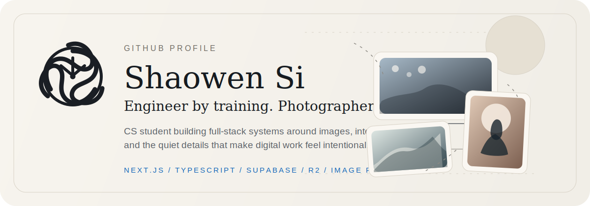
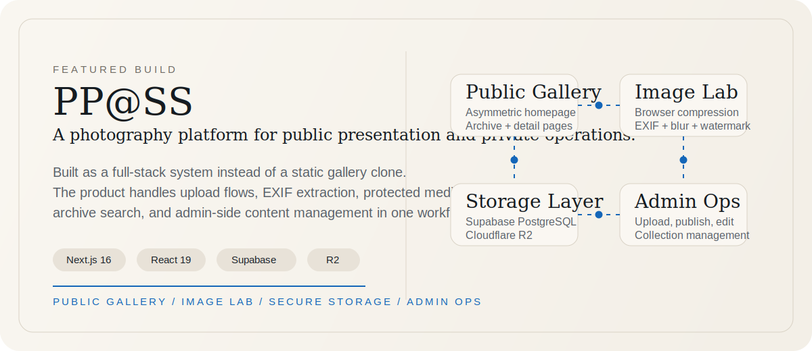

<p align="center">
  
</p>

<p align="center">
  <a href="https://github.com/SuperShawnSi/photography-portfolio">Featured Project</a>
  ·
  <a href="mailto:supershawnsi@gmail.com">Email</a>
  ·
  <a href="https://www.xiaohongshu.com/user/profile/60ab4fb3000000000101d3e2">Red Note</a>
</p>

<p align="center">
  Full-stack engineering, image workflows, and editorial interfaces shaped by photography.
</p>

---

## About

I am a CS student who likes building systems that feel composed rather than merely functional.
Most of my work lives at the intersection of product engineering and visual sensitivity:
media-heavy applications, careful UI structure, image pipelines, and tooling that supports real content workflows.

```text
identity: student / builder / photographer
focus: Next.js, TypeScript, Supabase, Cloudflare R2
interests: image systems, calm interfaces, information architecture
```

<p>
  
</p>

## Featured Build

<p>
  <a href="https://github.com/SuperShawnSi/photography-portfolio">
    
  </a>
</p>

### PP@SS

`PP@SS` is a photography platform built as a real full-stack product rather than a static portfolio clone.

- Public-facing gallery, archive navigation, and photo detail pages
- Browser-side image processing with EXIF extraction, compression, watermarking, thumbnails, and blur placeholders
- Secure media architecture with Supabase PostgreSQL plus Cloudflare R2
- Admin workflows for upload, publishing, tagging, and collection management

[Open the repository](https://github.com/SuperShawnSi/photography-portfolio)

<p>
  
</p>

## What I Care About

- Designing interfaces with a clear point of view instead of default component soup
- Building end-to-end systems where storage, metadata, and UX fit together cleanly
- Treating photography as both a creative practice and a product-design constraint

## Current Focus

- Refining portfolio-quality frontend systems with editorial spacing and motion restraint
- Building full-stack tools around media upload, search, and presentation
- Improving the gap between polished visual design and maintainable production code

## Reach Out

- GitHub: [@SuperShawnSi](https://github.com/SuperShawnSi)
- Email: [supershawnsi@gmail.com](mailto:supershawnsi@gmail.com)
- Red Note: [Photography Notes](https://www.xiaohongshu.com/user/profile/60ab4fb3000000000101d3e2)

<!--
SuperShawnSi/SuperShawnSi is the special profile repository.
This README renders on the GitHub profile homepage.
-->
